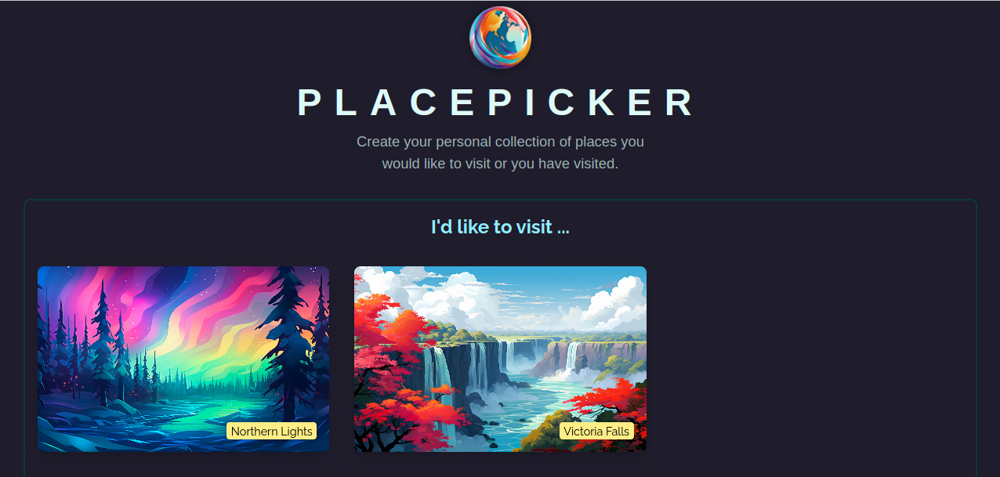
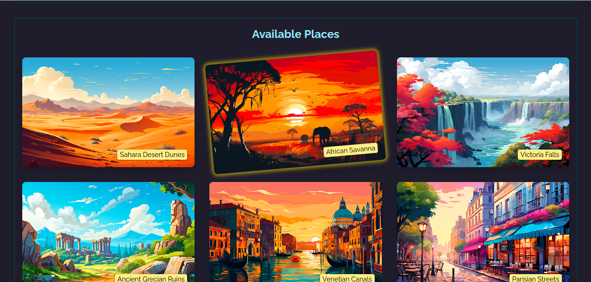

# PlacePicker Application

## Overview
PlacePicker is a ReactJS-based web application that allows users to explore and select places they would like to visit or have visited. The app features a list of available places, sorted by distance from the user's current location, and allows users to create a personal collection of favorite places. Users can add or remove places from their collection, with the app saving their selections locally in the browser's local storage.





## Features

**1.Place Selection:** Users can browse a list of places, which are sorted based on proximity to their current location. They can then select places they are interested in visiting, which will be added to their collection.

**Remove Place:** If a user changes their mind, they can remove a place from their collection. A modal confirmation dialog is shown to prevent accidental deletions.

**Location-based Sorting:** The application uses the browser's geolocation API to obtain the user's location and sorts the list of available places based on the distance from the user.

**Local Storage:** The app persists the user's selection using local storage, allowing users to retain their collection of places even after refreshing or closing the browser.

**Modal & Confirmation:** A modal dialog is used for confirming the deletion of a selected place, featuring a countdown timer to auto-confirm the deletion.

## Components

1. `App.jsx`

    - The main component that manages the state of the application.
    - Handles the list of available places, user selections, and manages the modal dialog for deletion confirmation.
    - Uses the navigator.geolocation API to sort places based on the user's location.
    - Stores and retrieves selected places from localStorage.

2. `Places.jsx`

    - Renders a list of places and allows users to select or remove places from their collection.
    - Displays a fallback message if no places are available.

3. `Modal.jsx`
    - A reusable modal component that displays its content in a dialog window.
    - Manages the dialog's open and close states.

4. `DeleteConfirmation.jsx`
    - Displays a confirmation message with "Yes" and "No" buttons for confirming or canceling the   deletion.
    - Automatically confirms the deletion after a countdown timer using the ProgressBar component.

5. `ProgressBar.jsx`
    - A progress bar component that visually shows the countdown before auto-confirmation of the deletion.

6. `data.js`

    - Contains the data for available places, including their IDs, titles, images, and geographical coordinates.

## Data Flow

**Geolocation:** On page load, the app requests the user's location and sorts the available places based on proximity.

**Selection:** Users can add places to their collection by clicking on them, and the app updates both the state and local storage.

**Removal:** When a user attempts to remove a place, a modal dialog is shown for confirmation. If confirmed (or auto-confirmed after a timer), the place is removed from the collection and local storage is updated.

## Installation and Setup

1. **Clone the Repository:**

```bash```
git clone https://github.com/your-repository-url
cd placepicker

2. **Install Dependencies:**

```bash```
npm install

3. **Run the Application:**

```bash```
npm start

4. **Access the Application:**

Open your browser and navigate to http://localhost:5173 to view the app.

## Technologies used

React: For user interface creation.
Vite: Used as a fast bundler for development.
JavaScript (ES6+): For application logic


## Future Enhancements

**Search Functionality:** Implement a search bar to filter available places.
**User Authentication:** Allow users to save their place collections to a database.
**Map Integration:** Display selected places on an interactive map.
**Social Sharing:** Enable users to share their collections on social media.

## .gitignore

The `.gitignore` file ensures that certain files and directories are not tracked by Git, such as:

Log files (e.g., `npm-debug.log`, `yarn-error.log`)
`node_modules/` directory
Build directories like `dist/`
Editor-specific directories and files like `.vscode/`, `.idea/`, etc.

## License
This project is licensed under the MIT License - see the LICENSE file for details.